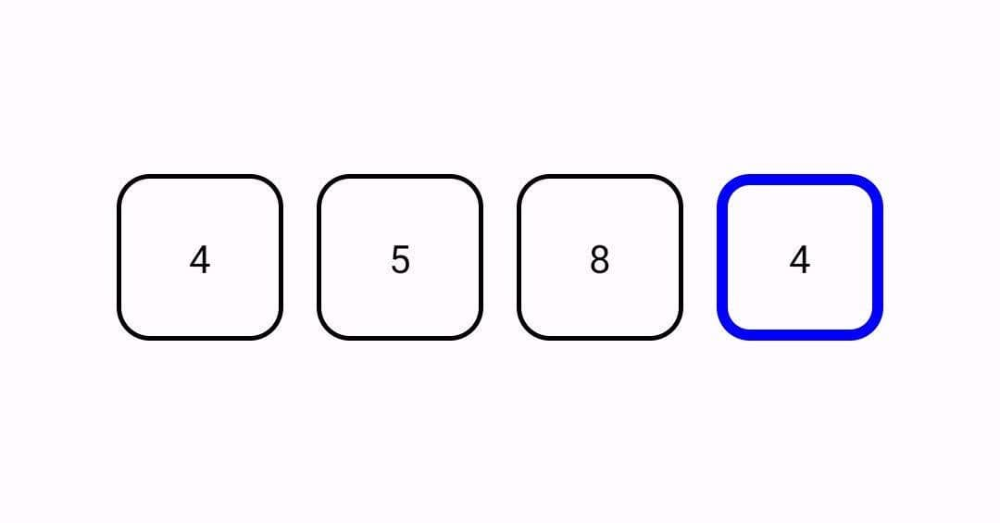
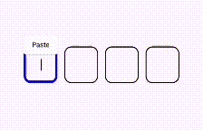
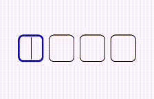

# OTPTextField Compose Library

[](https://jitpack.io/#sajjad-dehnavi/OTP_Field_compose)

`otptextfield` is a custom Composable library for creating One-Time Password (OTP) input fields in Jetpack Compose. It allows you to easily integrate OTP input fields with various customization options.





## Features

- Create OTP input fields with a specified number of digits.
- Customize appearance, borders, and text style.
- Support for password mode with hidden characters.
- Validation for wrong inputs.
- Callback when all input fields are filled.

## Installation

Add the following dependency to your app's build.gradle file:

```gradle
implementation "com.github.sajjad-dehnavi:OTP_Field_compose:1.0"
```
## Usage

To use the `OTPTextField` Composable, follow these steps:

1. Import the library in your Composable:

```kotlin
import dehnavi.sajjad.otptextfield.OtpTextField

// ... 

OtpTextField( modifier = Modifier, 
modifierField = Modifier,
numField = 4,
value = "", 
// ... other parameters
onFinishedChange = { otpValue -> 
 // Handle the OTP value }
  )
```

## Parameters

| Parameter           | Description                                        | Default Value    |
|---------------------|----------------------------------------------------|------------------|
| `modifier`          | Modifier for the entire OTP field.                | `Modifier`       |
| `modifierField`     | Modifier for individual OTP fields.               | `Modifier`       |
| `numField`          | Number of OTP digits.                             | `4`              |
| `value`             | Initial value of OTP.                             | `""`             |
| `passwordChar`      | Character to display in password mode.            | `'•'`            |
| `isPasswordMode`    | Whether to use password mode.                     | `false`           |
| `textStyle`         | Text style for OTP digits.                        | `TextStyle.Default` |
| `textSizePassword`  | Text size for password mode.                      | `24.sp`          |
| `borderShape`       | Border shape of OTP fields.                       | `RoundedCornerShape(12.dp)` |
| `borderColor`       | Border color of OTP fields.                       | `Color.Black`    |
| `borderFocusColor`  | Border color when focused.                        | `Color.Blue`     |
| `borderWrongColor`  | Border color for wrong input.                     | `Color.Red`      |
| `borderWidth`       | Border width of OTP fields.                       | `1.5.dp`           |
| `borderFocusWidth`  | Border width when focused.                        | `4.dp`           |
| `isWrong`           | Whether the input is wrong.                      | `false`           |
| `paddingFieldValue` | Padding for OTP fields.                           | `12.dp`          |
| `onFinishedChange`  | Callback when all input fields are filled.        | `null`           |

## Contributing

Contributions are welcome! Feel free to submit issues and pull requests.

<!--## License

This library is released under the MIT License.-->
